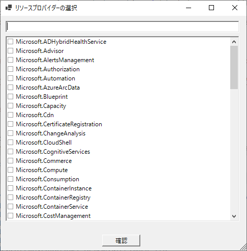

# 使い方

## 注意事項

- PowershellスクリプトはUTF8で保存しています。文字化けするときは一度メモ帳で開きコピーして、続いてPowershell_ISEで開いて貼り付けてください。
- Powershellスクリプトで3項演算子を用いているため、Powershellバージョン 7.0 以上で動作します。お使いのPowershellのバージョンを確認するには、Powershellで$PSVersionTableと実行します。

```Powershell
$PSVersionTable
# Name                           Value
# ----                           -----
# PSVersion                      7.4.4
# PSEdition                      Core
# GitCommitId                    7.4.4
# OS                             Microsoft Windows 10.0.19045
# Platform                       Win32NT
# PSCompatibleVersions           {1.0, 2.0, 3.0, 4.0…}
# PSRemotingProtocolVersion      2.3
# SerializationVersion           1.1.0.1
# WSManStackVersion              3.0
```

## サービスプリンシパルの作成

Microsoft EntraIDに対するアプリケーション管理者、サブスクリプションに対するユーザーアクセス管理者を有するアカウントで以下のコマンドを実行します。
画面に出力される、client_idとclient_secretはConfigファイルで用いるので控えてください。
スクリプト内の`<TENANTID`>、`<SUBSCRIPTIONID`>は適切な値に置き換えてください。

```Powershell
# ログイン
Connect-AzAccount -Tenant <TENANTID> -Subscription <SUBSCRIPTIONID>
# サービスプリンシパル作成/サブスクリプションに対するReader(閲覧者)ロールの割り当て
$sp = New-AzADServicePrincipal -DisplayName AzureUnitTestTool -Role Reader -Scope /subscriptions/<SUBSCRIPTIONID>
Write-Output ("clientId: {0}`nclientSecret: {1}" -f $sp.AppId, $sp.PasswordCredentials.SecretText)
```

## コンフィグファイルの作成

### 下準備

configフォルダ配下の「GetAzureResourceDotProperty.config.json」ファイルを開きます。
以下4つの値を埋めたら保存して閉じます。

- authentication.tenantId
- authentication.client_id
- authentication.client_secret
- subscriptionId

### コンフィグファイル作成の補助ツールの実行

configフォルダ配下の「EditResourcePropertiesOfConfigFile.ps1」ファイルを実行します。

- サブスクリプションで登録済みのリソースプロバイダーが表示されます。対象のリソースプロバイダーを複数選択可能です。



- 直前の操作で選択したリソースプロバイダーが提供するリソース種類が表示されます。対象のリソース種類を複数選択可能です。


- 選択したリソースタイプの名前、それが提供する最新のAPIバージョン、それからサブスクリプション上に存在するリソースからドット記法のキーを抽出し、コンフィグファイルの「resourceProperties」を更新します。

- スクリプトの実行が終了したら、コンフィグファイルを開き(config\GetAzureResourceDotProperty.config.json)、apiVersionやvisibleを適切に修正してください。

## ツールの実行

ツールを実行することで、サブスクリプション上に存在するリソースの中から、コンフィグファイルに記載されているリソース種類のリソースプロパティをドット記法で抽出します。
ツールを実行するには、ルート直下の「GetAzureResourceDotProperty.ps1」を実行します。
ツールが正常に実行完了すると、「.\output\」配下にツール実行時のタイムスタンプが付与されたフォルダが生成され、その下に以下3つのファイルが作成されます。
- dotNotation.csv
- resourceId.csv
- resourceType.csv

## 単体試験の開始

出力されたcsvファイルを元に単体試験を実施してください。
サンプルとして「Azure単体試験テンプレート.xlsx」というExcelファイルを用意しています。
このファイルの使い方はExcel内に記載しています。